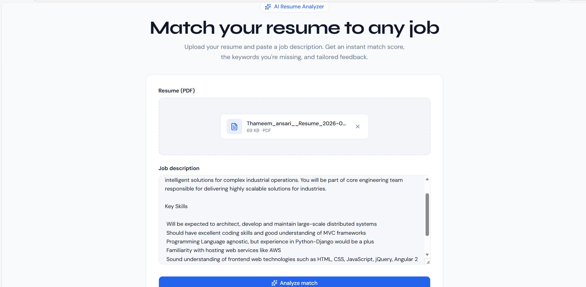
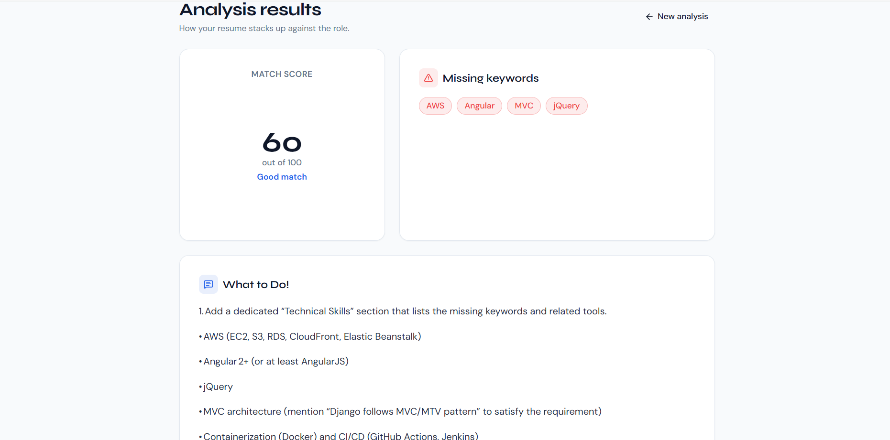

# AI Resume Analyzer

A full-stack tool that scores how well a resume matches a job description — combining deterministic skill-matching logic with LLM-powered qualitative feedback. Built to solve a real problem: understanding *why* a resume gets filtered out, and what to actually fix.

**Live Demo:** https://ai-resume-analyzer-vert-ten.vercel.app
**Backend API:** https://ai-resume-analyzer-hjgy.onrender.com
**GitHub:** github.com/thameem-16/ai-resume-analyzer

---

## Screenshots

<!-- Add screenshots here — login page, upload page, results page with score/keywords/AI feedback -->

| Upload | Results |
|---|---|
|  |  |

---

## The Problem

Most resume-checker tools either just run a keyword count (no real insight) or wrap an LLM call around everything (slow, expensive, and hard to test). This project uses a **hybrid approach**: a curated skills-taxonomy engine does fast, deterministic, testable scoring, while an LLM is used only where it adds real value — generating specific, actionable improvement suggestions.

---

## Features

- Upload a resume (PDF) and paste a job description — get an instant match score (0–100)
- Skill-gap detection against a curated taxonomy of 150+ technical skills, frameworks, and tools (not generic stopword filtering)
- AI-generated, specific improvement suggestions via the Groq API (Llama/OSS models)
- Token-based authentication — each user only sees their own resumes and analyses
- Per-user analysis history
- Fully automated test suite with mocked external API calls
- Containerized with Docker; automated testing via GitHub Actions CI/CD on every push

---

## Tech Stack

**Backend:** Python, Django, Django REST Framework
**Database:** PostgreSQL (hosted on Neon)
**AI:** Groq API (OpenAI OSS models)
**PDF Parsing:** pdfplumber
**Auth:** DRF Token Authentication
**Frontend:** React (Vite), Tailwind CSS
**Testing:** pytest, pytest-django, pytest-cov, unittest.mock
**DevOps:** Docker, GitHub Actions (CI), Render (backend hosting), Vercel (frontend hosting)

---

## Architecture

```
User uploads resume (PDF) + pastes job description
        ↓
Django REST Framework API (token-authenticated)
        ↓
Resume text extracted via pdfplumber
        ↓
Rule-based skill-matching engine scores resume vs. JD
        ↓
Groq API generates qualitative improvement feedback
        ↓
Result persisted per-user, returned to React frontend
```

**Design decision — no Celery/Redis:** async task queuing was deliberately left out. The full analysis pipeline (parsing, scoring, AI call) completes in 1–3 seconds — well within normal HTTP request handling. Adding background job infrastructure here would have been over-engineering for the actual workload; the honest, senior-minded call was to keep the request synchronous and simple.

---

## Testing

17 automated tests covering:
- Rule-based scoring logic (pure function tests — perfect match, partial match, case-insensitivity, multi-word skills)
- Model behavior (default states, string representations)
- Full authentication flow (registration, login, failure cases)
- End-to-end analysis flow with the Groq API **mocked** — tests never make real network calls
- Security: verified that one user cannot access another user's resumes or analyses via `get_queryset` filtering

Run locally:
```bash
pytest -v --cov=. --cov-report=term-missing
```

CI runs the full suite automatically on every push via GitHub Actions, against a fresh PostgreSQL service container.

---

## Local Setup

### Backend
```bash
git clone https://github.com/thameem-16/ai-resume-analyzer.git
cd ai-resume-analyzer
python -m venv .venv
.venv\Scripts\activate
pip install -r requirements.txt
```

Create a `.env` file:
```
SECRET_KEY=your-secret-key
DEBUG=True
DATABASE_URL=your-postgresql-connection-string
GROQ_API_KEY=your-groq-api-key
```

```bash
python manage.py migrate
python manage.py createsuperuser
python manage.py runserver
```

### Frontend
```bash
cd resume-analyzer-frontend
npm install
npm run dev
```

### Docker (alternative)
```bash
docker build -t resume-analyzer .
docker run -p 8000:8000 --env-file .env resume-analyzer
```

---

## What I Learned Building This

- Designed a hybrid scoring system rather than defaulting to "call an LLM for everything" — deterministic logic for the score, AI only for qualitative feedback, which is both cheaper and far easier to test.
- Learned to mock external API calls (Groq) in tests using `unittest.mock`, so the test suite runs fast, free, and reliably regardless of network conditions or API quotas.
- Hit and fixed a real floating-point precision bug: passing a Python `float` into a `Decimal` price field introduced binary rounding errors — fixed by always constructing `Decimal` from strings.
- Debugged a genuine Docker + WSL2 networking issue on Windows where DNS resolution failed from inside a container but worked fine on the host — resolved via a full WSL2 backend restart.
- Made a deliberate architecture call to skip Celery/Redis after evaluating that the actual workload didn't need async processing — avoiding infrastructure complexity that wouldn't have served the product.

---

## Author

**Thameem Ansari**
[LinkedIn](https://linkedin.com/in/thameem-ansari06) • [GitHub](https://github.com/thameem-16) • thameem16ansari@gmail.com
